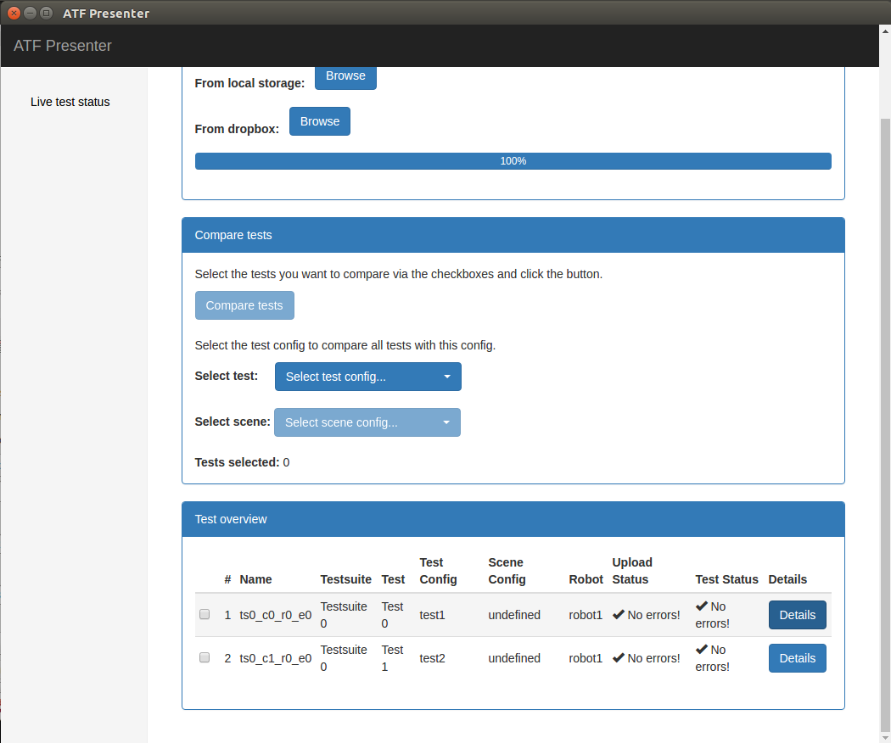
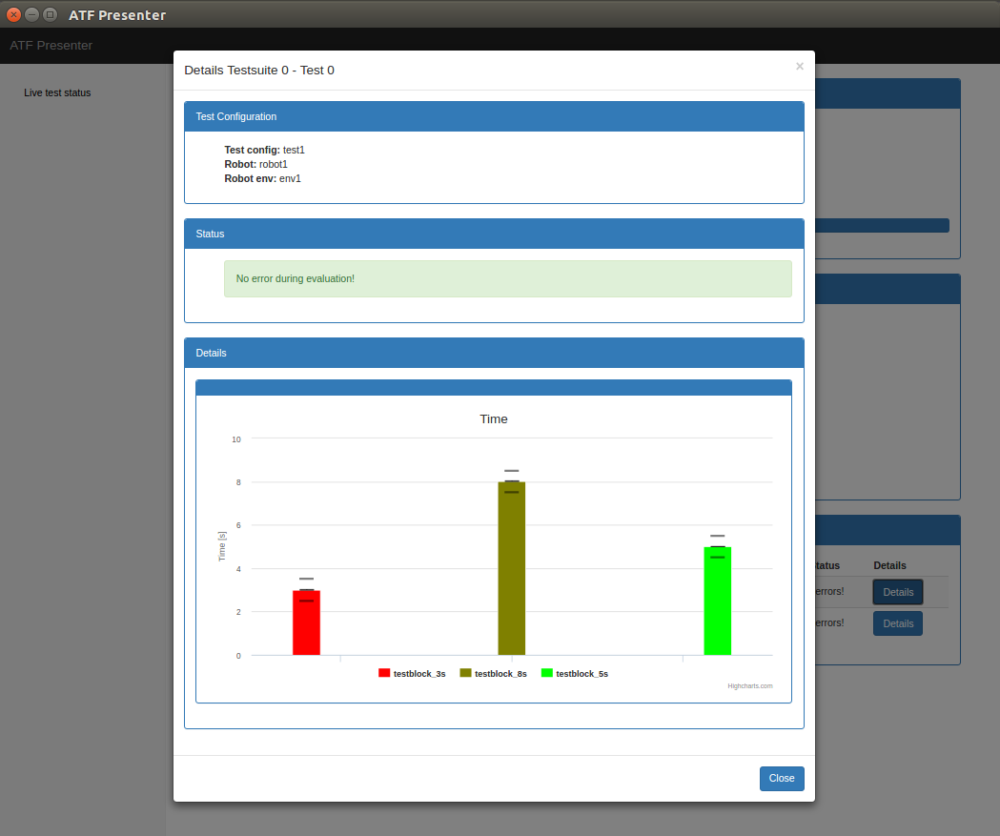

# Using the ATF (by examples)
* [Running simple atf test apps](Examples.md#running-simple-atf-test-apps)
* [Integrate the ATF into your own application](Examples.md#integrate-the-atf-into-your-own-application)
* [Automating ATF test execution](Examples.md#automating-atf-test-execution)
* [How to use the ATF with "simulation-in-the-loop"](Examples.md#how-to-use-the-atf-in-a-simulation-in-the-loop-setup-using-gazebo)
* [How to use the ATF for benchmarking](Examples.md#how-to-use-the-atf-for-benchmarking)

### Running simple atf test apps
###### Download and build test apps
For each [implemented metric](../README.md#implemented-metrics) there is a test app package that uses the metric in a simple application. You can find all the test apps in the [atf_test_apps](https://github.com/ipa-fmw/atf_test_apps) repository.

1. Get sources
```
cd ~/catkin_ws/src
wstool set atf_test_apps --git https://github.com/ipa-fmw/atf_test_apps.git
wstool update
```

1. Build and generate tests
```
cd ~/catkin_ws
catkin_make --force-cmake
```

###### Run the test apps
Run all tests:
```
cd ~/catkin_ws
catkin_make run_tests
```
or just tests from a specific package (e.g. for ```atf_test_app_time```):
```
cd ~/catkin_ws
catkin_make atf_atf_test_app_time
```

###### Check and visualize the results
If all goes well, you should see the recorded bag files in ```/tmp/atf_test_app_time```:
```
ls /tmp/atf_test_app_time/data
rosbag info /tmp/atf_test_app_time/data/ts0_c0_r0_e0_0.bag
```
and the (merged) results in ```/tmp/atf_test_app_time/results_yaml```:
```
cat /tmp/atf_test_app_time/results_yaml/merged_ts0_c0_r0_e0.yaml
```
You an use the ATF presenter to visualize the results in a webbrowser:
```
rosrun atf_presenter chromium.sh
```
You should now see 


Please select the file ```test_list.json``` and all ```merged_*.json``` files out of the ```results_json``` directory.


If all results could be loaded successfully you can press on the 'Details' button to see the test details.



Now for all analyzed metrics you will see a diagramm showing the average results, the min/max deviation and the allowed groundtruth tollerances.



### Integrate the ATF into your own application
###### Python
A python app with ATF looks as simple as
```
from atf_core import ATF

class Application:
    def __init__(self):
        # initialize the ATF class
        self.atf = ATF()                  

    def execute(self):
        # you can call start/pause/purge/stop for each testblock during the execution of your app

        self.atf.start("testblock_all")
        self.atf.start("testblock_1")

        # Do something

        self.atf.stop("testblock_1")
        self.atf.start("testblock_2")

        # Do something else

        self.atf.stop("testblock_2")
        self.atf.stop("testblock_all")

        # finally we'll have to call shutdown() to tell the ATF to stop all recordings and wrap up
        self.atf.shutdown()

class Test(unittest.TestCase):
    def setUp(self):
        self.app = Application()

    def tearDown(self):
        pass

    def test_Recording(self):
        self.app.execute()

if __name__ == '__main__':
    rospy.init_node('test_name')
    rostest.rosrun('application', 'recording', Test, sysargs=None)
```
Alongside with the modifications in the app code, you need to create some configuration files. Please have a look at the [atf test apps repository](https://github.com/ipa-fmw/atf_test_apps) for configuration references. Typically you will have the following files:
```
config/
├── robot_envs                   # directory for environment specific settings, each environment is configured in one <robot_env_name>.yaml file
│   └── env1.yaml
├── robots                       # directory for robot specific settings, each robot is configured in one <robot_name>.yaml file
│   ├── robot1.yaml
│   └── robot2.yaml
├── test_configs                 # directory for test configurations, each test is configured in one <test_config_name>.yaml file
│   ├── test1.yaml
│   └── test2.yaml
├── test_generation_config.yaml  # specifies how to generate test files
└── test_suites.yaml             # specifies the combination of test_configs, robots and robot_envs.
```
The last thing to modify is your ```package.xml``` and ```CMakeLists.txt```. Please add a dependency to ```atf_core``` and the following line which triggers the test file generation:
```
atf_test()
```

After a ```catkin_make --force-cmake``` you will find all the generated test files in ```<YOUR_PACKAGE>/test_generated```.
You can run them individually, e.g. the first recording test with
```
rostest <YOUR_PACKAGE> recording_ts0_c0_r0_e0_0.test
... further recording tests ...
```
followed by the first analysing test
```
rostest <YOUR_PACKAGE> analysing_ts0_c0_r0_e0_0.test
... further analysing tests ...
```
If all analysing tests are done you can merge them and use the ATF presenter for visualitzation
```
rostest <YOUR_PACKAGE> merging.test
rosrun atf_presenter chromium.sh
```
###### C++
not yet available
### Automating ATF test execution
If you have your test app written and configuration setup as shown in the [example above](Examples.md#integrate-the-atf-into-your-own-application), there are new catkin targets which trigger the execution of tests in a package:
* ```catkin_make atf_<YOUR_PACKAGE>_cleaning ```: cleans all test artefacts (bag, json and yaml files)
* ```catkin_make atf_<YOUR_PACKAGE>_recording```: triggers the ```cleaning``` target and all recording tests
* ```catkin_make atf_<YOUR_PACKAGE>_analysing```: triggers the ```recording``` target and all analysing tests
* ```catkin_make atf_<YOUR_PACKAGE>_merging  ```: triggers the ```analysing``` target and the merge test
* ```catkin_make atf_<YOUR_PACKAGE>_uploading```: triggers the ```merging``` target and the uploading test
* ```catkin_make atf_<YOUR_PACKAGE>          ```: triggers all tests in your package
* ```catkin_make run_tests                   ```: triggers all tests in your catkin workspace

You can use the targets to setup you continuous integration scripts. An example for [travis](https://travis-ci.org/) can be found in the [atf test apps repository](https://github.com/ipa-fmw/atf_test_apps). Have a look at the ```.travis.yml``` file.

### How to use the ATF in a "simulation-in-the-loop" setup using [gazebo](http://gazebosim.org/)
If you'd like to run tests using gazebo, you just setup a launch file which starts all nodes and add that to your ```test_generation.yaml``` as ```additional_launch_file```. This launch file will then be included in all the tests. As catkin normaly uses multiple threads for executing the tests, we'll need to limit that to only one concurrent job as running multiple gazebo instances at a time causes troubles. Thus run your tests with
```
catkin_make run_tests -j1
```

For our travis scripts you can set the ```CATKIN_TEST_ARGUMENTS``` environment variable:
```
env:
  global:
    CATKIN_TEST_ARGUMENTS=-j1
```
### How to use the ATF for benchmarking
TBD
